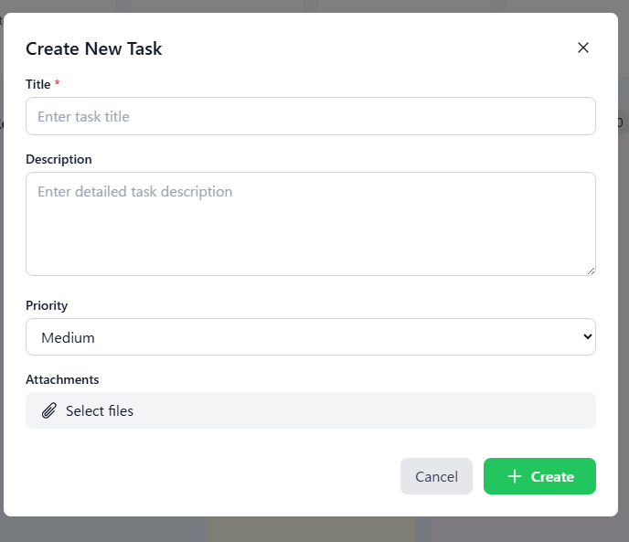
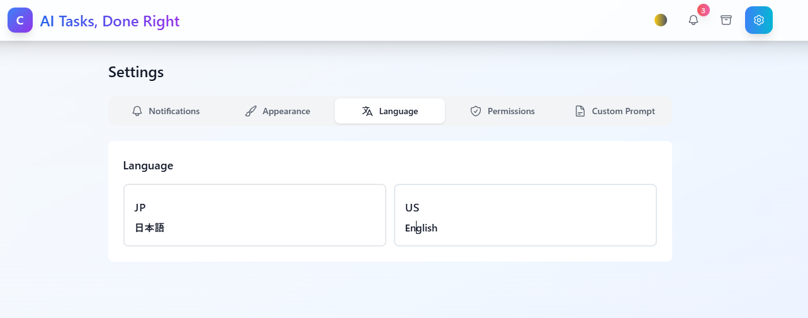
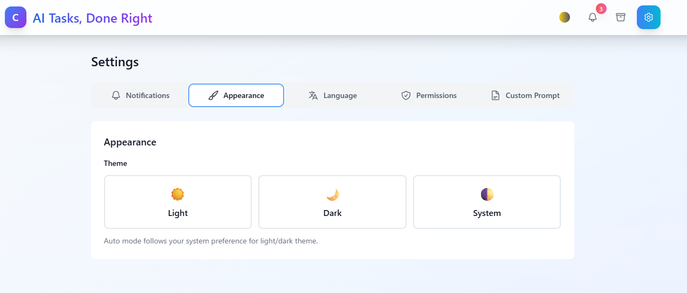
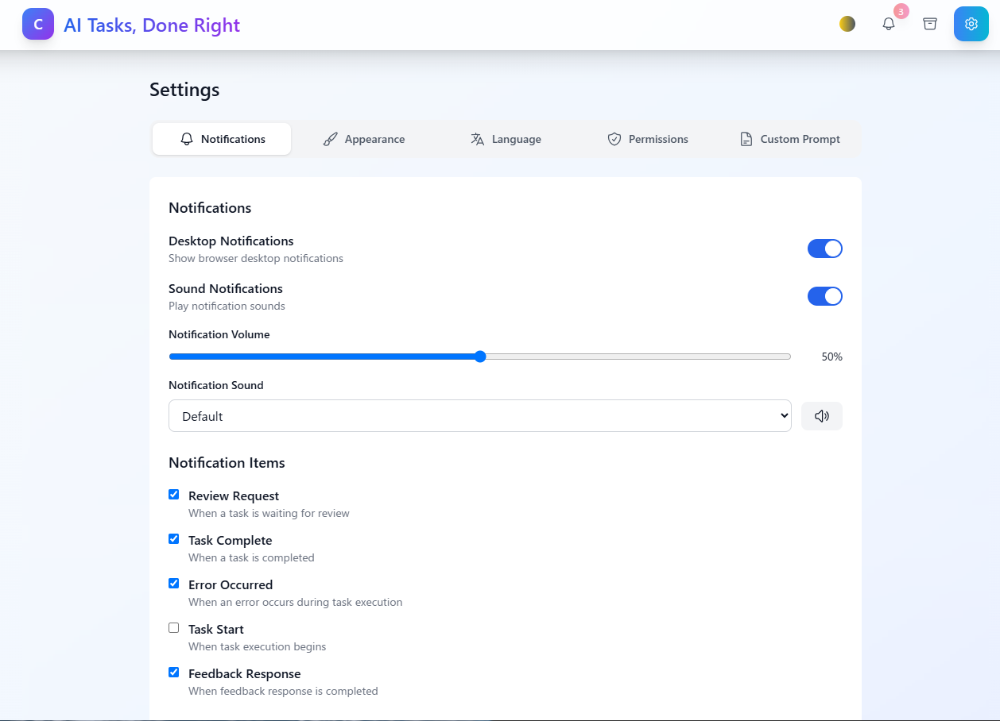
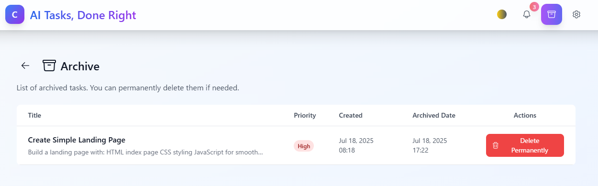
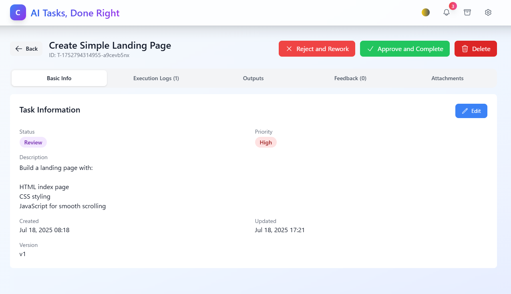

# Claude Code カンバン自動実行システム

Claude Codeを使用してタスクを自動実行するカンバンスタイルのタスク管理システムです。このオープンソースツールは、Claude Codeとシームレスに統合し、ビジュアルなプロジェクト管理インターフェースで自動タスク実行を提供します。


## ⚠️ **重要: rootユーザーでの作業禁止**

**Claude Codeはセキュリティ上の理由により、rootユーザーでは`--dangerously-skip-permissions`が使用できません。**

インストール前に、必ず一般ユーザーアカウント（root以外）で作業してください：

```bash
# 現在のユーザー確認（'root'であってはいけません）
whoami

# rootの場合は、一般ユーザーを作成して切り替え
sudo adduser ユーザー名
sudo usermod -aG sudo ユーザー名  # 必要に応じてsudo権限を付与
su - ユーザー名

# または既存ユーザーに切り替え
su - ユーザー名
```

**⚠️ このアプリケーションは絶対にrootユーザーでインストール・実行しないでください！**

## 🚀 主な機能

### タスク管理
- **カンバンボードインターフェース**: ドラッグ＆ドロップによる視覚的なタスク管理
- **タスク優先度設定**: 高・中・低の優先度レベル
- **ステータス追跡**: 未対応 → 作業依頼 → 作業中 → レビュー → 完了のワークフロー
- **タグとカテゴリ**: カスタムタグによるタスク整理

## Screenshots

<div align="center">
<table>
<tr>
<td align="center">
<h3>新規タスク作成</h3>

<br>
<em>タイトル、説明、優先度、添付ファイルを含む新規タスク作成画面</em>
</td>
<td align="center">
<h3>カンバンボード</h3>

<br>
<em>タスク実行通知を表示するカンバンボードビュー</em>
</td>
</tr>
<tr>
<td align="center">
<h3>言語設定</h3>

<br>
<em>言語選択 - 日本語/英語サポート</em>
</td>
<td align="center">
<h3>テーマ設定</h3>

<br>
<em>外観設定 - ライト/ダーク/システムテーマオプション</em>
</td>
</tr>
</table>
<table>
<tr>
<td align="center">
<h3>通知設定</h3>

<br>
<em>デスクトップ通知、音声アラート、通知項目の設定</em>
</td>
<td align="center">
<h3>アーカイブ</h3>

<br>
<em>完了タスクを管理するアーカイブビュー</em>
</td>
</tr>
<tr>
<td align="center">
<h3>タスクフィードバック</h3>

<br>
<em>タスクレビューと修正依頼のためのフィードバックインターフェース</em>
</td>
<td align="center">
<h3>タスク情報</h3>

<br>
<em>ステータス、優先度、バージョン管理を表示するタスク詳細</em>
</td>
</tr>
</table>
</div>


### 自動化
- **Claude Code統合**: 同一環境での自動タスク実行
- **キュー管理**: 優先度ベースの実行キューと設定可能な同時実行数
- **リトライロジック**: 失敗時の自動リトライと設定可能な制限
- **リアルタイム進捗**: WebSocketベースのライブ実行進捗更新

### コラボレーション
- **フィードバックシステム**: タスクにフィードバックを追加し、Claude Codeが自動的に対応
- **レビューワークフロー**: タスク完了前の人間によるレビューステップ
- **バージョン追跡**: タスク実行の複数イテレーションを追跡

### 通知
- **リアルタイム通知**: WebSocket駆動の即時通知
- **デスクトップ通知**: ブラウザ通知サポート
- **音声アラート**: カスタマイズ可能な通知音
- **通知センター**: 一元化された通知管理

## 📋 必要条件

- Node.js >= 18.0.0
- npm または yarn
- Claude Code（PATHに配置済み）
- SQLite3

## 🛠️ インストール

### 必要な環境

- **Node.js** (v18.0.0以上) - [ダウンロード](https://nodejs.org/)
- **Git** - [ダウンロード](https://git-scm.com/)
- **Claude Code** (オプション) - [インストールガイド](https://docs.anthropic.com/claude-code)

### ワンコマンドセットアップ

```bash
git clone https://github.com/cruzy-japan/claude-code-kanban-automator.git
cd claude-code-kanban-automator
chmod +x install.sh
./install.sh
```

### アプリケーション起動

**オプション1: 別々のターミナル（推奨）**
```bash
# ターミナル1: バックエンド起動
npm run dev:backend

# ターミナル2: フロントエンド起動
npm run dev:frontend
```

**オプション2: 一括起動（問題が発生する可能性あり）**
```bash
# システムによっては正常に動作しない場合があります
npm run dev
```

### アクセスURL

- **フロントエンド**: http://localhost:5173
- **バックエンドAPI**: http://localhost:5001/api
- **ヘルスチェック**: http://localhost:5001/api/health

### 手動セットアップ（上級者向け）

#### 3. バックエンドの依存関係をインストール:
```bash
cd backend
npm install
# 必要に応じて不足している開発依存関係をインストール
npm install --save-dev nodemon ts-node
cd ..
```

#### 4. フロントエンドの依存関係をインストール:
```bash
cd frontend
npm install
# 必要に応じて不足しているUIコンポーネントをインストール
npm install @headlessui/react @heroicons/react react-hot-toast
cd ..
```

#### 5. バックエンド用のTypeScriptを設定:
strict modeの問題に対処するため、`backend/tsconfig.json`を作成または更新:
```json
{
  "extends": "../tsconfig.json",
  "compilerOptions": {
    "outDir": "./dist",
    "rootDir": "./src",
    "noUnusedLocals": false,
    "noUnusedParameters": false,
    "noImplicitAny": false,
    "noPropertyAccessFromIndexSignature": false,
    "strictNullChecks": false,
    "noImplicitOverride": false
  },
  "include": ["src/**/*"],
  "exclude": ["node_modules", "dist", "tests"]
}
```

#### 6. フロントエンド環境ファイルを作成:
```bash
cat > frontend/.env << EOF
VITE_API_URL=http://localhost:5001/api
VITE_WS_URL=ws://localhost:5001
EOF
```

#### 7. ルート環境変数をコピーして設定:
```bash
cp .env.example .env
# 必要に応じて.envファイルを編集
```

**重要**: Claude Code実行の設定:
- Claude Codeがインストール済みの場合: `.env`で`CLAUDE_CODE_COMMAND=claude-code`を設定
- Claude Codeなしでテストする場合: モックスクリプトを使用（デフォルト）: `CLAUDE_CODE_COMMAND=./scripts/mock-claude-code.sh`
- 詳細は[Claude Codeセットアップガイド](docs/claude-code-setup.md)を参照

#### 8. データベースを初期化:
```bash
npm run db:init
```

#### 9. 開発サーバーを起動:

**オプション1 - npm run devを使用（問題が発生する可能性あり）:**
```bash
npm run dev
```

**オプション2 - サーバーを個別に起動（推奨）:**
```bash
# ターミナル1 - バックエンド
cd backend
npm run dev

# ターミナル2 - フロントエンド
cd frontend
npm run dev
```

#### 10. インストールを確認:
アプリケーションは以下のURLで利用可能です:
- フロントエンド: http://localhost:5173
- バックエンドAPI: http://localhost:5001/api
- ヘルスチェック: http://localhost:5001/health

APIをテスト:
```bash
curl http://localhost:5001/health
# 以下が返されるはずです: {"status":"ok","timestamp":"...","websocket_clients":0}
```

### よくある問題のトラブルシューティング

#### TypeScript Strict Modeエラー
`process.env`やプロパティアクセスに関連するTypeScriptエラーが発生した場合:
- `backend/tsconfig.json`に手順5で示した緩和設定があることを確認
- process.envアクセスにはブラケット記法を使用: `process.env['KEY']`

#### 不足している依存関係
モジュールが見つからない場合:
```bash
# sqlite3とdotenvの場合
npm install sqlite3 dotenv

# バックエンド開発ツールの場合
cd backend && npm install --save-dev nodemon ts-node

# フロントエンドUIコンポーネントの場合
cd frontend && npm install @headlessui/react @heroicons/react react-hot-toast
```

#### データベース接続エラー
`SQLITE_CANTOPEN`エラーが表示される場合:
- データベースが初期化されていることを確認: `npm run db:init`
- バックエンドのデータベースパスが実際の場所と一致することを確認
- `database/tasks.db`が存在することを確認

#### ポートがすでに使用中
ポート5001または5173がすでに使用されている場合:
```bash
# ポート5001のプロセスを終了
lsof -ti:5001 | xargs kill -9

# または別のポートを使用
PORT=5002 npm run dev
```

#### インポートパスエラー
ローカルインポートで「module not found」エラーが表示される場合:
- 明示的なパスを使用: `import { Task } from '../types/index'`
- 使用しない: `import { Task } from '../types'`

#### CSS/Tailwindエラー
不明なCSSクラスエラーが表示される場合:
- カスタムクラスを標準のTailwindユーティリティに置き換える
- Tailwind CSSが適切に設定されていることを確認

### Dockerインストール

Docker Composeを使用:

```bash
# 開発モード
docker-compose -f docker-compose.dev.yml up

# 本番モード
docker-compose up -d
```

## ⚙️ 設定

### 環境変数

ルートディレクトリに`.env`ファイルを作成:

```env
# データベース設定
DATABASE_PATH=./database/tasks.db

# 出力ディレクトリ
OUTPUT_DIR=./outputs

# Claude Code実行設定
CLAUDE_CODE_COMMAND=claude-code
CLAUDE_CODE_WORK_DIR=./claude-code-workspace

# サーバー設定
PORT=5001
HOST=localhost

# 実行設定
MAX_CONCURRENT_TASKS=3
TASK_CHECK_INTERVAL=60000  # ミリ秒

# JWT シークレット（本番環境では変更してください）
JWT_SECRET=your-secret-key-here

# Node環境
NODE_ENV=development
```

## 📖 使用方法

### タスクの作成

1. ダッシュボードの「新規タスク」ボタンをクリック
2. タスクの詳細を入力:
   - タイトル（必須）
   - 説明
   - 優先度
   - 期限
   - 推定作業時間
   - タグ

3. 「作成」をクリックしてタスクを作成

### タスクワークフロー

1. **未対応**: 新規作成されたタスクはここから開始
2. **作業依頼**: タスクをここにドラッグするか「実行」をクリックして実行キューに追加
3. **作業中**: Claude Codeがタスクを実行中
4. **レビュー**: タスク完了、人間のレビュー待ち
5. **完了**: タスクが承認され完了

### フィードバックの提供

1. 「レビュー」ステータスのタスクに移動
2. タスクをクリックして詳細を開く
3. 「フィードバック」タブに移動
4. フィードバックを入力
5. 「差戻して再作業」をクリックして修正を依頼

## 🏗️ アーキテクチャ

システムは以下のコンポーネントで構成されています：

- **フロントエンド**: React + TypeScript + Tailwind CSS
- **バックエンド**: Node.js + Express + TypeScript
- **データベース**: SQLite
- **リアルタイム通信**: WebSocket
- **タスク実行**: Claude Code統合

## 🔧 トラブルシューティング

### よくある問題

#### カスタムプロンプトが適用されない

**問題**: 設定でカスタムプロンプトを入力しても、タスクのprompt.mdに反映されない。

**解決方法**:
```bash
# データベースマイグレーションを実行
npm run db:migrate

# または、手動でマイグレーションを適用
node scripts/apply-migration.js
```

これによりデータベースに`custom_prompt_instructions`カラムが追加され、カスタムプロンプト機能が有効になります。

#### Root/Sudo権限エラー

**エラー**: `"cannot be use with root/sudo privileges for security reason"`

**原因**: rootユーザーでアプリケーションを実行すると、Claude Codeのセキュリティ制限が発動します。

**解決方法**:

1. **非rootユーザーに切り替え**（推奨）:
   ```bash
   # 現在のユーザー確認
   whoami
   
   # rootの場合は通常ユーザーに切り替え
   su - ユーザー名
   ```

2. **危険な権限モードを無効化**:
   - ブラウザでアプリケーションを開く
   - 設定 → 権限設定に移動
   - 「危険な権限モード」を**オフ**にする

3. **アプリケーションをリセット**:
   ```bash
   # データベースを削除して再起動
   rm -f database/tasks.db
   npm run db:init
   npm run dev
   ```

**重要**: セキュリティ上の理由から、このアプリケーションは必ず通常ユーザーで実行してください。rootやsudoは使用しないでください。

**Q: Claude Codeが見つからない**
A: Claude CodeがPATHに含まれていることを確認してください。`which claude-code`コマンドで確認できます。

**Q: データベースエラーが発生する**
A: `npm run db:init`を実行してデータベースを初期化してください。

**Q: WebSocket接続が失敗する**
A: ファイアウォールがポート5001をブロックしていないか確認してください。

## 🗑️ 完全初期化 / アプリケーションリセット

アプリケーションを完全に初期状態に戻したい場合：

### 完全リセット

**方法1: ディレクトリ削除（最もシンプル）**
```bash
# 完全削除して新規インストール
cd ..
rm -rf claude-code-kanban-automator

# 新規インストール
git clone https://github.com/cruzy-japan/claude-code-kanban-automator.git
cd claude-code-kanban-automator
chmod +x install.sh
./install.sh
```

**方法2: 部分リセット**
```bash
# 全プロセス停止
npm run clean

# 全データと生成ファイル削除
rm -rf database/tasks.db
rm -rf outputs/*
rm -rf uploads/*
rm -rf claude-code-workspace/*
rm -rf logs/*

# .gitkeepファイル保持
touch outputs/.gitkeep uploads/.gitkeep claude-code-workspace/.gitkeep logs/.gitkeep

# データベース再初期化
npm run db:init

# アプリケーション再起動
npm run dev:backend  # ターミナル1
npm run dev:frontend # ターミナル2
```

## 🤝 貢献

1. リポジトリをフォーク
2. フィーチャーブランチを作成 (`git checkout -b feature/amazing-feature`)
3. 変更をコミット (`git commit -m 'Add some amazing feature'`)
4. ブランチにプッシュ (`git push origin feature/amazing-feature`)
5. プルリクエストを作成

## 📝 ライセンス

このプロジェクトはMITライセンスの下でライセンスされています - 詳細は[LICENSE](LICENSE)ファイルを参照してください。

## 🙏 謝辞

- [Claude Code](https://claude.ai/code)との統合のために構築
- モダンなカンバンツールにインスパイアされたUI
- [Heroicons](https://heroicons.com/)のアイコン使用