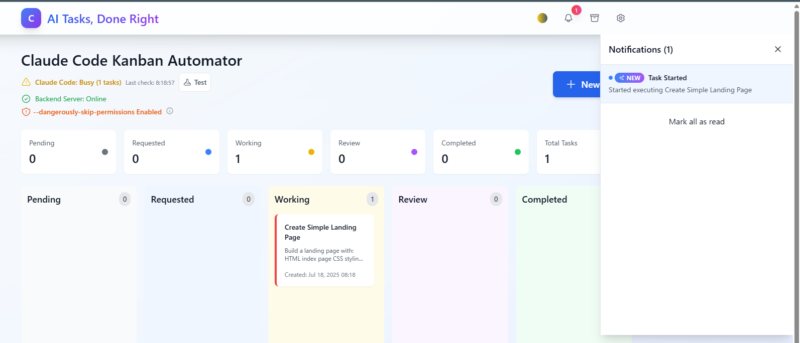

# Claude Code カンバン自動実行システム

Claude Codeを使用してタスクを自動実行するカンバンスタイルのタスク管理システムです。AIによるタスク自動化とビジュアルなプロジェクト管理でワークフローを変革します。


## ⚠️ **重要: rootユーザーでの作業禁止**

**Claude Codeはセキュリティ上の理由により、rootユーザーでは`--dangerously-skip-permissions`が使用できません。**

インストール前に、必ず一般ユーザーアカウント（root以外）で作業してください：

```bash
# 現在のユーザー確認（'root'であってはいけません）
whoami

# rootの場合は、一般ユーザーを作成して切り替え
sudo adduser ユーザー名
sudo usermod -aG sudo ユーザー名  # 必要に応じてsudo権限を付与
su - ユーザー名

# または既存ユーザーに切り替え
su - ユーザー名
```

**⚠️ このアプリケーションは絶対にrootユーザーでインストール・実行しないでください！**

## 🎯 なぜClaude Code カンバン自動実行システムか？

このツールはタスク管理とAI実行のギャップを埋め、以下を可能にします：
- **カンバンボードでタスクを視覚的にキュー管理**
- **Claude Codeで自動実行**
- **フィードバックループでレビューと反復**
- **リアルタイムで進捗を追跡**

## スクリーンショット

<div align="center">
<table>
<tr>
<td align="center">
<h3>機能一覧</h3>

<br>
</td>
</tr>
</table>
</div>

<div align="center">
<table>
<tr>
<td align="center">
<h3>新規タスク作成</h3>

<br>
<em>タイトル、説明、優先度、添付ファイルを含む新規タスク作成画面</em>
</td>
<td align="center">
<h3>カンバンボード</h3>

<br>
<em>タスク実行通知を表示するカンバンボードビュー</em>
</td>
</tr>
<tr>
<td align="center">
<h3>言語設定</h3>

<br>
<em>言語選択 - 日本語/英語サポート</em>
</td>
<td align="center">
<h3>テーマ設定</h3>

<br>
<em>外観設定 - ライト/ダーク/システムテーマオプション</em>
</td>
</tr>
</table>
<table>
<tr>
<td align="center">
<h3>通知設定</h3>

<br>
<em>デスクトップ通知、音声アラート、通知項目の設定</em>
</td>
<td align="center">
<h3>アーカイブ</h3>

<br>
<em>完了タスクを管理するアーカイブビュー</em>
</td>
</tr>
<tr>
<td align="center">
<h3>タスクフィードバック</h3>

<br>
<em>タスクレビューと修正依頼のためのフィードバックインターフェース</em>
</td>
<td align="center">
<h3>タスク情報</h3>

<br>
<em>ステータス、優先度、バージョン管理を表示するタスク詳細</em>
</td>
</tr>
</table>
</div>

## 🚀 主な機能

### 🎨 ビジュアルタスク管理
- **優先度ベースのキューシステム**（高/中/低）
- **WebSocketによるリアルタイムステータス更新**
- **反復的な改善のためのタスクバージョン管理**

### 🤖 AI駆動の自動化
- **直接的なClaude Code統合** - お使いの環境で実行
- **設定可能な制限での同時タスク実行**
- **指数バックオフによる自動リトライロジック**
- **タスクごとまたはグローバルなカスタムプロンプト指示**

### 💬 コラボレーションワークフロー
- **フィードバックシステム** - コメントを追加しClaude Codeが対応
- **レビューワークフロー** - 完了前の人間による承認
- **ファイル添付** - Claude Codeとコンテキストを共有
- **出力管理** - 生成されたファイルをダウンロード

### 🔔 スマート通知
- **リアルタイムWebSocket更新**
- **音声アラート付きデスクトップ通知**
- **カスタマイズ可能な通知設定**
- **停滞タスクの検出とアラート**

## 🛠️ クイックインストール

### 必要な環境

- **Node.js** (v18.0.0以上) - [ダウンロード](https://nodejs.org/)
- **Git** - [ダウンロード](https://git-scm.com/)
- **Claude Code** (オプション) - [インストールガイド](https://docs.anthropic.com/claude-code)

### ワンコマンドセットアップ

```bash
git clone https://github.com/cruzyjapan/claude-code-kanban-automator.git
cd claude-code-kanban-automator
chmod +x install.sh
./install.sh
```

### アプリケーション起動

**オプション1: 別々のターミナル（推奨）**
```bash
# ターミナル1: バックエンド起動
npm run dev:backend

# ターミナル2: フロントエンド起動
npm run dev:frontend
```

**オプション2: 一括起動（問題が発生する可能性あり）**
```bash
# システムによっては正常に動作しない場合があります
npm run dev
```

### アクセスURL

- **フロントエンド**: http://localhost:5173
- **バックエンドAPI**: http://localhost:5001/api
- **ヘルスチェック**: http://localhost:5001/api/health

**注意**: フロントエンドはデフォルトでポート5173で実行されます（Viteの標準ポート）。このポートが既に使用されている場合、Viteは自動的に次の利用可能なポート（5174、5175など）を使用します。

### 手動セットアップ（上級者向け）

#### 1. 手動インストール

```bash
# すべての依存関係をインストール
npm install
cd backend && npm install && cd ..
cd frontend && npm install && cd ..

# 必要なディレクトリを作成
mkdir -p database outputs uploads claude-code-workspace logs

# 環境設定を作成
cp .env.example .env
# または手動で作成:
cat > .env << 'EOF'
# データベース
DATABASE_PATH=./database/tasks.db

# 出力ディレクトリ
OUTPUT_DIR=./outputs

# Claude Code設定
# テスト用にモックを使用、実際の統合には'claude'に置き換え
CLAUDE_CODE_COMMAND=claude
CLAUDE_CODE_WORK_DIR=./claude-code-workspace

# サーバー設定
PORT=5001
HOST=localhost

# 実行設定
MAX_CONCURRENT_TASKS=3
TASK_CHECK_INTERVAL=5000               # チェック間隔（ミリ秒）（5秒）
RETRY_LIMIT=3

# セキュリティ
JWT_SECRET=your-secret-key-here

# 環境
NODE_ENV=development
EOF

# フロントエンド環境を作成
cat > frontend/.env << 'EOF'
VITE_API_URL=http://localhost:5001/api
VITE_WS_URL=ws://localhost:5001
EOF

# データベースを初期化
node -e "
const sqlite3 = require('sqlite3').verbose();
const fs = require('fs');
const path = require('path');

const dbPath = './database/tasks.db';
const schemaPath = './database/schema.sql';

const schema = fs.readFileSync(schemaPath, 'utf8');
const db = new sqlite3.Database(dbPath);

db.exec(schema, (err) => {
  if (err) {
    console.error('データベース初期化に失敗しました:', err);
    process.exit(1);
  }
  console.log('データベースが正常に初期化されました');
  db.close();
});
"
```

#### 2. Claude Code統合の設定

Claude Codeがインストールされている場合:

```bash
# .envファイルを更新して実際のClaude Codeを使用
sed -i 's|CLAUDE_CODE_COMMAND=.*|CLAUDE_CODE_COMMAND=claude|' .env

# またはmacOSの場合:
sed -i '' 's|CLAUDE_CODE_COMMAND=.*|CLAUDE_CODE_COMMAND=claude|' .env
```

#### 3. アプリケーションを起動

```bash
# 開発モード（初回実行時推奨）
npm run dev

# またはサービスを個別に起動:
# ターミナル1:
npm run dev:backend

# ターミナル2:
npm run dev:frontend
```

#### 4. アプリケーションにアクセス

- **フロントエンド**: http://localhost:5173
- **バックエンドAPI**: http://localhost:5001/api
- **ヘルスチェック**: http://localhost:5001/api/health

**注意**: フロントエンドはデフォルトでポート5173で実行されます（Viteの標準ポート）。このポートが既に使用されている場合、Viteは自動的に次の利用可能なポート（5174、5175など）を使用します。

## 🔧 設定

### 環境変数

`.env`ファイルで主要な設定を制御します：

```env
# Claude Code統合
CLAUDE_CODE_COMMAND=claude              # Claude Code実行コマンド
CLAUDE_CODE_WORK_DIR=./workspace        # タスク用作業ディレクトリ

# 実行制限
MAX_CONCURRENT_TASKS=3                  # 最大並列実行数
TASK_CHECK_INTERVAL=5000               # チェック間隔（ミリ秒）（5秒）               # チェック間隔（ミリ秒）
RETRY_LIMIT=3                          # 失敗時の最大リトライ回数

# サーバー設定
PORT=5001                              # バックエンドポート
DATABASE_PATH=./database/tasks.db      # SQLiteデータベースの場所
```

### カスタムプロンプト指示

すべてのClaude Code実行にグローバル指示を追加:

1. 設定 → カスタムプロンプトに移動
2. 指示を追加（例：コーディング規約、言語設定）
3. 保存 - これらはすべてのタスク実行に含まれます

### 🔐 権限設定（重要）

Claude Codeがファイルやフォルダを正しく生成するためには、**危険な権限モード**を有効にする必要があります：

1. **設定画面から有効化（推奨）**:
   - ブラウザでアプリケーションを開く
   - 設定 → 権限設定に移動
   - 「危険な権限モード」を**オン**にする

2. **なぜ必要か**:
   - Claude Codeの標準モードでは、セキュリティ上の理由からファイル生成が制限されています
   - `--dangerously-skip-permissions`フラグを使用することで、タスク実行時にファイルやフォルダの生成が可能になります
   - このフラグがないと、Claude Codeは読み取り専用モードで動作します
   - **具体例**：
     - ✅ 有効時：新しいコンポーネント作成、ファイル生成、フォルダ作成、コード自動生成が可能
     - ❌ 無効時：既存ファイルの読み取りと分析のみ可能、新規ファイル作成不可

3. **セキュリティ上の注意**:
   - このモードは信頼できるタスクのみで使用してください
   - 不明なコードや外部から提供されたタスクを実行する場合は無効にしてください
   - **絶対にrootユーザーでは使用しないでください**

## 📋 使用ガイド

### 最初のタスクの作成

1. ダッシュボードの**「新規タスク」**をクリック
2. 以下を入力:
   - **タイトル**: 明確で実行可能なタスク名
   - **説明**: 詳細な要件
   - **優先度**: 高/中/低
   - **添付ファイル**: 参照ファイル
3. **「作成」**をクリック

### タスクワークフロー

```
未対応 → 作業依頼 → 作業中 → レビュー → 完了
  ↑         ↓          ↓        ↓
  └─────────┴──────────┴────────┘ (フィードバックループ)
```

1. **未対応**: 新規タスクはここから開始
2. **作業依頼**: ここにドラッグして実行キューに追加
3. **作業中**: Claude Codeが処理中
4. **レビュー**: 人間の承認待ち
5. **完了**: タスク完了・承認済み

### フィードバックの提供

1. **レビュー**ステータスのタスクをクリック
2. **フィードバック**タブに移動
3. 必要な具体的な改善点を入力
4. **「差戻して再作業」**をクリック

## 🏗️ アーキテクチャ概要

```
claude-code-kanban-automator/
├── frontend/                 # React + TypeScript + Vite
│   ├── src/
│   │   ├── components/      # 再利用可能なUIコンポーネント
│   │   ├── pages/          # ルートページ
│   │   ├── contexts/       # Reactコンテキストプロバイダー
│   │   ├── services/       # API通信
│   │   └── types/          # TypeScript定義
│   └── public/             # 静的アセット
│
├── backend/                 # Node.js + Express + TypeScript
│   └── src/
│       ├── controllers/    # ルートハンドラー
│       ├── services/       # ビジネスロジック
│       │   ├── claude-code-executor.service.ts
│       │   ├── task-execution-monitor.service.ts
│       │   └── websocket.service.ts
│       ├── routes/         # APIエンドポイント
│       └── types/          # 型定義
│
├── database/               # SQLiteストレージ
│   ├── schema.sql         # データベース構造
│   └── tasks.db           # メインデータベース
│
├── claude-code-workspace/  # 分離された実行環境
└── outputs/               # タスクから生成されたファイル
```

## 🗑️ クリーンアップ / アプリケーションのリセット

アプリケーションを完全に初期状態に戻したい場合：

### 完全リセット（各オプション）

**方法1: ディレクトリ削除（最もシンプル）**
```bash
# 完全削除して新規インストール
cd ..
rm -rf claude-code-kanban-automator

# 新規インストール
git clone https://github.com/cruzy-japan/claude-code-kanban-automator.git
cd claude-code-kanban-automator
chmod +x install.sh
./install.sh
```

**方法2: 部分リセット**
```bash
# すべての実行中のプロセスを停止
npm run clean

# すべてのデータと生成ファイルを削除
rm -rf database/tasks.db
rm -rf outputs/*
rm -rf uploads/*
rm -rf claude-code-workspace/*
rm -rf logs/*

# .gitkeepファイルを保持
touch outputs/.gitkeep uploads/.gitkeep claude-code-workspace/.gitkeep logs/.gitkeep

# データベースを再初期化
node -e "
const sqlite3 = require('sqlite3').verbose();
const fs = require('fs');
const schema = fs.readFileSync('./database/schema.sql', 'utf8');
const db = new sqlite3.Database('./database/tasks.db');
db.exec(schema, (err) => {
  if (err) console.error(err);
  else console.log('データベースが正常にリセットされました');
  db.close();
});"

# アプリケーションを再起動
npm run dev:backend  # ターミナル1
npm run dev:frontend # ターミナル2
```

### 部分リセットオプション

```bash
# タスクデータのみクリア（設定を保持）
rm -rf database/tasks.db outputs/* claude-code-workspace/*

# 出力とワークスペースのみクリア
rm -rf outputs/* claude-code-workspace/*

# アップロードのみクリア
rm -rf uploads/*
```

### 削除できないフォルダ

一部のフォルダはシステムによって保護またはロックされている場合があります：

1. **node_modules/**: 実行中のプロセスによってロックされたファイルが含まれる可能性があります
   ```bash
   # まずすべてのNodeプロセスを停止
   npm run clean
   # その後削除
   rm -rf node_modules backend/node_modules frontend/node_modules
   ```

2. **dist/**: TypeScriptコンパイル中にロックされる可能性があります
   ```bash
   # ビルドプロセスを停止して削除
   rm -rf backend/dist
   ```

3. **実行中のワークスペースディレクトリ**: Claude Codeがアクティブに実行中の場合
   ```bash
   # 実行中のプロセスを確認
   ps aux | grep claude
   # 必要に応じて終了してから削除
   rm -rf claude-code-workspace/*
   ```

### 権限の問題

権限エラーが発生した場合：

```bash
# ファイルを書き込み可能にする
chmod -R 755 outputs/ uploads/ claude-code-workspace/ logs/

# 必要に応じて強制削除（注意して使用）
sudo rm -rf outputs/* uploads/* claude-code-workspace/*
```

## 🐛 トラブルシューティング

### よくある問題と解決策

#### カスタムプロンプトが適用されない

**問題**: 設定で入力したカスタムプロンプト指示がタスクのprompt.mdファイルに反映されない。

**解決策**:
```bash
# データベースマイグレーションを実行
npm run db:migrate

# または手動でマイグレーションを適用
node scripts/apply-migration.js
```

これによりデータベースに`custom_prompt_instructions`カラムが追加され、カスタムプロンプト機能が有効になります。

#### Root/Sudo権限エラー

**エラー**: `"cannot be use with root/sudo privileges for security reason"`

**原因**: rootユーザーでアプリケーションを実行すると、Claude Codeのセキュリティ制限が発動します。

**解決策**:

1. **非rootユーザーに切り替え**（推奨）:
   ```bash
   # 現在のユーザーを確認
   whoami
   
   # rootの場合は通常ユーザーに切り替え
   su - your-username
   ```

2. **危険な権限モードを無効化**:
   - ブラウザでアプリケーションを開く
   - 設定 → 権限設定に移動
   - 「危険な権限モード」を**オフ**にする

3. **アプリケーションをリセット**:
   ```bash
   # データベースを削除して再起動
   rm -f database/tasks.db
   npm run db:init
   npm run dev
   ```

**重要**: セキュリティ上の理由から、このアプリケーションは必ず通常ユーザーで実行してください。rootやsudoは使用しないでください。

#### バックエンドが起動しない

```bash
# ポートが使用中か確認
lsof -i :5001

# 必要に応じてプロセスを終了
kill -9 <PID>

# または別のポートを使用
PORT=5002 npm run dev:backend
```

#### データベースエラー

```bash
# データベースを再作成
rm database/tasks.db
npm run db:init
# または: node scripts/init-db.js

# 権限を確認
ls -la database/
chmod 644 database/tasks.db
```

#### フロントエンドビルドエラー

```bash
# キャッシュをクリアして再インストール
cd frontend
rm -rf node_modules package-lock.json
npm install
npm run dev
```

#### Claude Codeが見つからない

```bash
# インストールを確認
which claude

# 必要に応じてPATHに追加
export PATH="$PATH:/path/to/claude"

# テスト用にモックを使用
# .envを編集: CLAUDE_CODE_COMMAND=./scripts/mock-claude-code.sh
```

## 🚀 本番環境へのデプロイ

### 本番用ビルド

```bash
# フロントエンドとバックエンドの両方をビルド
npm run build

# 本番サーバーを起動
NODE_ENV=production npm start
```

### PM2の使用

```bash
# PM2をグローバルにインストール
npm install -g pm2

# アプリケーションを起動
pm2 start ecosystem.config.js

# モニター
pm2 monit
```

### Dockerデプロイメント

```bash
# Docker Composeでビルドして実行
docker-compose up -d

# ログを表示
docker-compose logs -f
```

## 🤝 貢献

貢献を歓迎します！詳細は[貢献ガイド](CONTRIBUTING.md)をご覧ください。

1. リポジトリをフォーク
2. フィーチャーブランチを作成 (`git checkout -b feature/amazing-feature`)
3. 変更をコミット (`git commit -m 'Add amazing feature'`)
4. ブランチにプッシュ (`git push origin feature/amazing-feature`)
5. プルリクエストを作成

## 📝 ライセンス

このプロジェクトはMITライセンスの下でライセンスされています - 詳細は[LICENSE](LICENSE)ファイルを参照してください。

## 🙏 謝辞

- [Claude Code](https://claude.ai/code)とのシームレスな統合のために構築
- [Headless UI](https://headlessui.com/)と[Heroicons](https://heroicons.com/)のUIコンポーネント
- [Tailwind CSS](https://tailwindcss.com/)によるスタイリング

## 📞 サポート

- **Issues**: [GitHub Issues](https://github.com/cruzy-japan/claude-code-kanban-automator/issues)
- **Discussions**: [GitHub Discussions](https://github.com/cruzy-japan/claude-code-kanban-automator/discussions)
- **Documentation**: [Wiki](https://github.com/cruzy-japan/claude-code-kanban-automator/wiki)

---

Made with ❤️ by [Cruzy Japan](https://cruzy.jp) | クルージジャパン株式会社