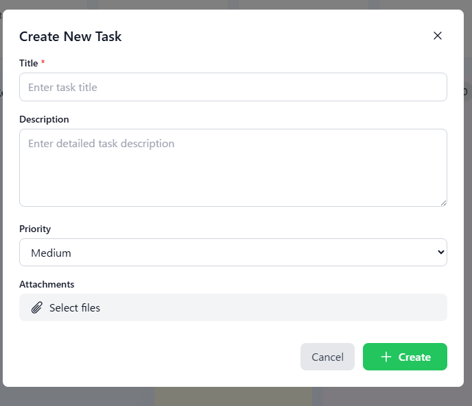
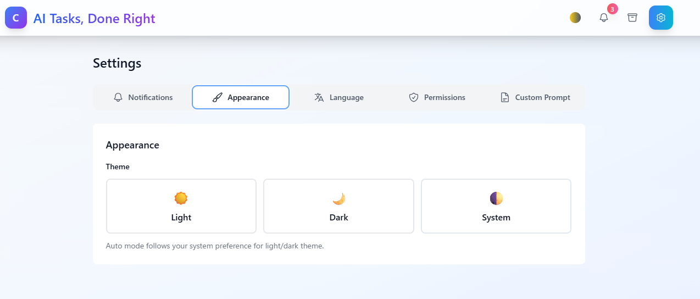
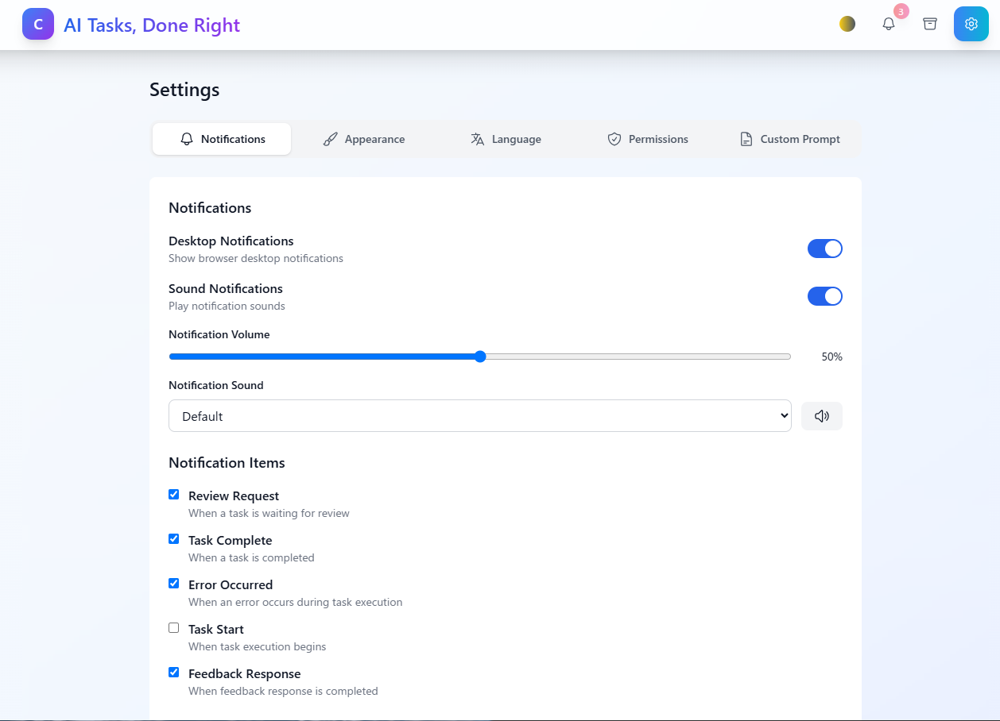
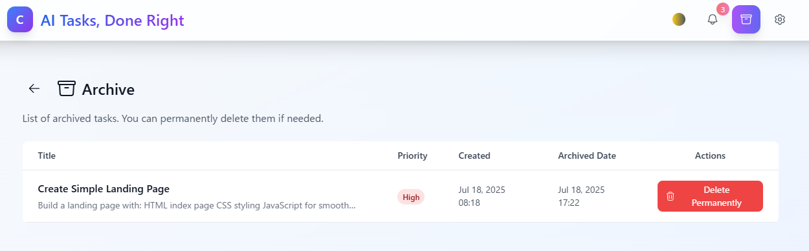

# AI Tasks, Done Right - Claude Code Kanban Automator

A powerful Kanban-style task management system that seamlessly integrates with Claude Code to automate task execution. Transform your workflow with AI-powered task automation and visual project management.


## ⚠️ **IMPORTANT: Do Not Use Root User**

**Claude Code cannot use `--dangerously-skip-permissions` when running as root user for security reasons.**

Before installation, ensure you are using a regular user account (not root):

```bash
# Check current user (should NOT be 'root')
whoami

# If you are root, create and switch to a regular user
sudo adduser yourusername
sudo usermod -aG sudo yourusername  # Add sudo privileges if needed
su - yourusername

# Or switch to existing user
su - yourusername
```

**⚠️ Never install or run this application as root user!**

## 🎯 Why Claude Code Kanban Automator?

This tool bridges the gap between task management and AI execution, allowing you to:
- **Queue tasks visually** on a Kanban board
- **Execute automatically** with Claude Code
- **Review and iterate** with feedback loops
- **Track progress** in real-time

## Screenshots

<div align="center">
<table>
<tr>
<td align="center">
<h3>Diagram</h3>

<br>
</td>
</tr>
</table>
</div>

<div align="center">
<table>
<tr>
<td align="center">
<h3>Create New Task</h3>

<br>
<em>Create new task modal with title, description, priority, and attachments</em>
</td>
<td align="center">
<h3>Kanban Board</h3>

<br>
<em>Kanban board view with task execution notification</em>
</td>
</tr>
<tr>
<td align="center">
<h3>Language Settings</h3>

<br>
<em>Language selection - Japanese/English support</em>
</td>
<td align="center">
<h3>Theme Settings</h3>

<br>
<em>Appearance settings - Light/Dark/System theme options</em>
</td>
</tr>
</table>
<table>
<tr>
<td align="center">
<h3>Notification Settings</h3>

<br>
<em>Configure desktop notifications, sound alerts, and notification items</em>
</td>
<td align="center">
<h3>Archive</h3>

<br>
<em>Archive view for managing completed tasks</em>
</td>
</tr>
<tr>
<td align="center">
<h3>Task Feedback</h3>

<br>
<em>Feedback interface for task review and revision requests</em>
</td>
<td align="center">
<h3>Task Information</h3>

<br>
<em>Task details showing status, priority, and version control</em>
</td>
</tr>
</table>
</div>

## 🚀 Key Features

### 🎨 Visual Task Management
- **Priority-based queue system** (High/Medium/Low)
- **Real-time status updates** via WebSocket
- **Task versioning** for iterative improvements

### 🤖 AI-Powered Automation
- **Direct Claude Code integration** - runs in your environment
- **Concurrent task execution** with configurable limits
- **Automatic retry logic** with exponential backoff
- **Custom prompt instructions** per task or globally

### 💬 Collaborative Workflow
- **Feedback system** - Add comments and Claude Code addresses them
- **Review workflow** - Human approval before completion
- **File attachments** - Share context with Claude Code
- **Output management** - Download generated files

### 🔔 Smart Notifications
- **Real-time WebSocket updates**
- **Desktop notifications** with sound alerts
- **Customizable notification preferences**
- **Stuck task detection** and alerts

## 🛠️ Quick Installation

### Prerequisites

- **Node.js** (v18.0.0 or higher) - [Download](https://nodejs.org/)
- **Git** - [Download](https://git-scm.com/)
- **Claude Code** (optional) - [Installation Guide](https://docs.anthropic.com/claude-code)

### One-Command Setup

```bash
git clone https://github.com/cruzyjapan/claude-code-kanban-automator.git
cd claude-code-kanban-automator
chmod +x install.sh
./install.sh
```

### Start the Application

**Option 1: Separate Terminals (Recommended)**
```bash
# Terminal 1: Start Backend
npm run dev:backend

# Terminal 2: Start Frontend  
npm run dev:frontend
```

**Option 2: Single Command (May Have Issues)**
```bash
# This may not work reliably on all systems
npm run dev
```

### Access URLs

- **Frontend**: http://localhost:5173
- **Backend API**: http://localhost:5001/api
- **Health Check**: http://localhost:5001/api/health

**Note**: The frontend runs on port 5173 by default (Vite's standard port). If this port is already in use, Vite will automatically use the next available port (5174, 5175, etc.).

### Manual Setup (Advanced Users)

#### 1. Manual Installation

```bash
# Install all dependencies
npm install
cd backend && npm install && cd ..
cd frontend && npm install && cd ..

# Create required directories
mkdir -p database outputs uploads claude-code-workspace logs

# Create environment configuration
cp .env.example .env
# Or create manually:
cat > .env << 'EOF'
# Database
DATABASE_PATH=./database/tasks.db

# Output directory  
OUTPUT_DIR=./outputs

# Claude Code settings
# Use mock for testing, replace with 'claude' for real integration
CLAUDE_CODE_COMMAND=claude
CLAUDE_CODE_WORK_DIR=./claude-code-workspace

# Server settings
PORT=5001
HOST=localhost

# Execution settings
MAX_CONCURRENT_TASKS=3
TASK_CHECK_INTERVAL=5000               # Check interval in milliseconds (5 seconds)
RETRY_LIMIT=3

# Security
JWT_SECRET=your-secret-key-here

# Environment
NODE_ENV=development
EOF

# Create frontend environment
cat > frontend/.env << 'EOF'
VITE_API_URL=http://localhost:5001/api
VITE_WS_URL=ws://localhost:5001
EOF

# Initialize database
node -e "
const sqlite3 = require('sqlite3').verbose();
const fs = require('fs');
const path = require('path');

const dbPath = './database/tasks.db';
const schemaPath = './database/schema.sql';

const schema = fs.readFileSync(schemaPath, 'utf8');
const db = new sqlite3.Database(dbPath);

db.exec(schema, (err) => {
  if (err) {
    console.error('Database initialization failed:', err);
    process.exit(1);
  }
  console.log('Database initialized successfully');
  db.close();
});
"
```

#### 2. Configure Claude Code Integration

If you have Claude Code installed:

```bash
# Update the .env file to use real Claude Code
sed -i 's|CLAUDE_CODE_COMMAND=.*|CLAUDE_CODE_COMMAND=claude|' .env

# Or on macOS:
sed -i '' 's|CLAUDE_CODE_COMMAND=.*|CLAUDE_CODE_COMMAND=claude|' .env
```

#### 3. Start the Application

```bash
# Development mode (recommended for first run)
npm run dev

# Or start services separately:
# Terminal 1:
npm run dev:backend

# Terminal 2:  
npm run dev:frontend
```

#### 4. Access the Application

- **Frontend**: http://localhost:5173
- **Backend API**: http://localhost:5001/api
- **Health Check**: http://localhost:5001/api/health

**Note**: The frontend runs on port 5173 by default (Vite's standard port). If this port is already in use, Vite will automatically use the next available port (5174, 5175, etc.).

## 🔧 Configuration

### Environment Variables

The `.env` file controls key settings:

```env
# Claude Code Integration
CLAUDE_CODE_COMMAND=claude              # Command to run Claude Code
CLAUDE_CODE_WORK_DIR=./claude-code-workspace        # Working directory for tasks

# Execution Limits
MAX_CONCURRENT_TASKS=3                  # Max parallel executions
TASK_CHECK_INTERVAL=5000               # Check interval in milliseconds (5 seconds)               # Check interval (ms)
RETRY_LIMIT=3                          # Max retries on failure

# Server Configuration  
PORT=5001                              # Backend port
DATABASE_PATH=./database/tasks.db      # SQLite database location
```

### Custom Prompt Instructions

Add global instructions for all Claude Code executions:

1. Navigate to Settings → Custom Prompt
2. Add your instructions (e.g., coding standards, language preferences)
3. Save - these will be included in all task executions

### 🔐 Permission Settings (Important)

To enable Claude Code to properly generate files and folders, you need to enable **dangerous permissions mode**:

1. **Enable from Settings (Recommended)**:
   - Open the application in your browser
   - Go to Settings → Permission Settings
   - Turn ON "Dangerous Permissions Mode"

2. **Why it's necessary**:
   - Claude Code's standard mode restricts file generation for security reasons
   - Using the `--dangerously-skip-permissions` flag allows file and folder creation during task execution
   - Without this flag, Claude Code operates in read-only mode
   - **Examples**:
     - ✅ Enabled: Can create new components, generate files, create folders, auto-generate code
     - ❌ Disabled: Can only read and analyze existing files, cannot create new files

3. **Security Notice**:
   - Only use this mode for trusted tasks
   - Disable it when executing unknown code or externally provided tasks
   - **Never use this with root user privileges**

## 📋 Usage Guide

### Creating Your First Task

1. Click **"New Task"** on the dashboard
2. Enter:
   - **Title**: Clear, actionable task name
   - **Description**: Detailed requirements
   - **Priority**: High/Medium/Low
   - **Attachments**: Any reference files
3. Click **"Create"**

### Task Workflow

```
Pending → Requested → Working → Review → Completed
   ↑         ↓           ↓         ↓
   └─────────┴───────────┴─────────┘ (Feedback loop)
```

1. **Pending**: New tasks start here
2. **Requested**: Drag here to queue for execution
3. **Working**: Claude Code is processing
4. **Review**: Awaiting human approval
5. **Completed**: Task finished and approved

### Providing Feedback

1. Click a task in **Review** status
2. Navigate to **Feedback** tab
3. Enter specific improvements needed
4. Click **"Send back for rework"**

## 🏗️ Architecture Overview

```
claude-code-kanban-automator/
├── frontend/                 # React + TypeScript + Vite
│   ├── src/
│   │   ├── components/      # Reusable UI components
│   │   ├── pages/          # Route pages
│   │   ├── contexts/       # React context providers
│   │   ├── services/       # API communication
│   │   └── types/          # TypeScript definitions
│   └── public/             # Static assets
│
├── backend/                 # Node.js + Express + TypeScript
│   └── src/
│       ├── controllers/    # Route handlers
│       ├── services/       # Business logic
│       │   ├── claude-code-executor.service.ts
│       │   ├── task-execution-monitor.service.ts
│       │   └── websocket.service.ts
│       ├── routes/         # API endpoints
│       └── types/          # Type definitions
│
├── database/               # SQLite storage
│   ├── schema.sql         # Database structure
│   └── tasks.db           # Main database
│
├── claude-code-workspace/  # Isolated execution environments
└── outputs/               # Generated files from tasks
```

## 🗑️ Cleaning Up / Resetting the Application

If you need to completely reset the application to its initial state:

### Complete Reset (Nuclear Option)

**Method 1: Directory Removal (Simplest)**
```bash
# Complete removal and fresh install
cd ..
rm -rf claude-code-kanban-automator

# Fresh installation
git clone https://github.com/cruzy-japan/claude-code-kanban-automator.git
cd claude-code-kanban-automator
chmod +x install.sh
./install.sh
```

**Method 2: Partial Reset**
```bash
# Stop all running processes
npm run clean

# Remove all data and generated files
rm -rf database/tasks.db
rm -rf outputs/*
rm -rf uploads/*
rm -rf claude-code-workspace/*
rm -rf logs/*

# Keep .gitkeep files
touch outputs/.gitkeep uploads/.gitkeep claude-code-workspace/.gitkeep logs/.gitkeep

# Reinitialize database
node -e "
const sqlite3 = require('sqlite3').verbose();
const fs = require('fs');
const schema = fs.readFileSync('./database/schema.sql', 'utf8');
const db = new sqlite3.Database('./database/tasks.db');
db.exec(schema, (err) => {
  if (err) console.error(err);
  else console.log('Database reset successfully');
  db.close();
});"

# Restart application
npm run dev:backend  # Terminal 1
npm run dev:frontend # Terminal 2
```

### Partial Reset Options

```bash
# Clear only task data (keep settings)
rm -rf database/tasks.db outputs/* claude-code-workspace/*

# Clear only outputs and workspace
rm -rf outputs/* claude-code-workspace/*

# Clear only uploads
rm -rf uploads/*
```

### Folders That Cannot Be Deleted

Some folders may be protected or locked by the system:

1. **node_modules/**: May contain files locked by running processes
   ```bash
   # Stop all Node processes first
   npm run clean
   # Then remove
   rm -rf node_modules backend/node_modules frontend/node_modules
   ```

2. **dist/**: May be locked during TypeScript compilation
   ```bash
   # Stop build processes and remove
   rm -rf backend/dist
   ```

3. **Running workspace directories**: If Claude Code is actively executing
   ```bash
   # Check for running processes
   ps aux | grep claude
   # Kill if necessary, then remove
   rm -rf claude-code-workspace/*
   ```

### Permission Issues

If you encounter permission errors:

```bash
# Make files writable
chmod -R 755 outputs/ uploads/ claude-code-workspace/ logs/

# Force remove if needed (use with caution)
sudo rm -rf outputs/* uploads/* claude-code-workspace/*
```

## 🐛 Troubleshooting

### Common Issues and Solutions

#### Custom Prompt Not Applied

**Problem**: Custom prompt instructions entered in settings are not reflected in task prompt.md files.

**Solution**:
```bash
# Run database migration
npm run db:migrate

# Or manually apply migration
node scripts/apply-migration.js
```

This adds the `custom_prompt_instructions` column to the database and enables the custom prompt feature.

#### Root/Sudo Permission Error

**Error**: `"cannot be use with root/sudo privileges for security reason"`

**Cause**: Running the application as root user triggers security restrictions in Claude Code.

**Solutions**:

1. **Switch to non-root user** (Recommended):
   ```bash
   # Check current user
   whoami
   
   # If you're root, switch to regular user
   su - your-username
   ```

2. **Disable dangerous permissions mode**:
   - Open the application in browser
   - Go to Settings → Permission Settings
   - Turn OFF "Dangerous Permissions Mode"

3. **Reset application**:
   ```bash
   # Remove database and restart
   rm -f database/tasks.db
   npm run db:init
   npm run dev
   ```

**Important**: Always run this application as a regular user, not as root or with sudo, for security reasons.

#### Backend Won't Start

```bash
# Check if port is in use
lsof -i :5001

# Kill process if needed
kill -9 <PID>

# Or use different port
PORT=5002 npm run dev:backend
```

#### Database Errors

```bash
# Recreate database
rm database/tasks.db
npm run db:init
# Or: node scripts/init-db.js

# Check permissions
ls -la database/
chmod 644 database/tasks.db
```

#### Frontend Build Errors

```bash
# Clear cache and reinstall
cd frontend
rm -rf node_modules package-lock.json
npm install
npm run dev
```

#### Claude Code Not Found

```bash
# Verify installation
which claude

# Add to PATH if needed
export PATH="$PATH:/path/to/claude"

# Use mock for testing
# Edit .env: CLAUDE_CODE_COMMAND=./scripts/mock-claude-code.sh
```

## 🚀 Production Deployment

### Build for Production

```bash
# Build both frontend and backend
npm run build

# Start production server
NODE_ENV=production npm start
```

### Using PM2

```bash
# Install PM2 globally
npm install -g pm2

# Start application
pm2 start ecosystem.config.js

# Monitor
pm2 monit
```

### Docker Deployment

```bash
# Build and run with Docker Compose
docker-compose up -d

# View logs
docker-compose logs -f
```

## 🤝 Contributing

We welcome contributions! Please see our [Contributing Guide](CONTRIBUTING.md) for details.

1. Fork the repository
2. Create your feature branch (`git checkout -b feature/amazing-feature`)
3. Commit changes (`git commit -m 'Add amazing feature'`)
4. Push to branch (`git push origin feature/amazing-feature`)
5. Open a Pull Request

## 📝 License

This project is licensed under the MIT License - see the [LICENSE](LICENSE) file for details.

## 🙏 Acknowledgments

- Built for seamless integration with [Claude Code](https://claude.ai/code)
- UI components from [Headless UI](https://headlessui.com/) and [Heroicons](https://heroicons.com/)
- Styling with [Tailwind CSS](https://tailwindcss.com/)

## 📞 Support

- **Issues**: [GitHub Issues](https://github.com/cruzy-japan/claude-code-kanban-automator/issues)
- **Discussions**: [GitHub Discussions](https://github.com/cruzy-japan/claude-code-kanban-automator/discussions)
- **Documentation**: [Wiki](https://github.com/cruzy-japan/claude-code-kanban-automator/wiki)

---

Made with ❤️ by [Cruzy Japan](https://cruzy.jp) | クルージジャパン株式会社